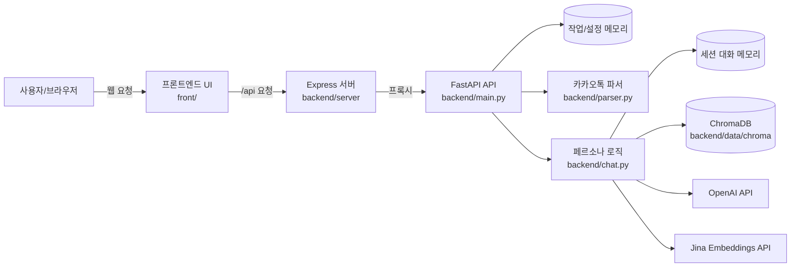

# 시스템 다이어그램

아래 다이어그램은 로컬 개발 환경 기준의 구성과 통신 흐름을 보여줍니다.

```mermaid
flowchart LR
  user[사용자/브라우저]
  front[프론트엔드 UI<br/>front/]
  express[Express 서버<br/>backend/server]
  fastapi[FastAPI API<br/>backend/main.py]
  jobs[(작업/설정 메모리)]
  memory[(세션 대화 메모리)]
  parser[카카오톡 파서<br/>backend/parser.py]
  persona[페르소나 로직<br/>backend/chat.py]
  chroma[(ChromaDB<br/>backend/data/chroma)]
  openai[OpenAI API]
  jina[Jina Embeddings API]

  user -->|웹 요청| front
  front -->|/api 요청| express
  express -->|프록시| fastapi

  fastapi --> jobs
  fastapi --> parser
  fastapi --> persona
  persona --> memory
  persona --> chroma
  persona --> openai
  persona --> jina
```

개발 모드에서는 Express가 Vite 미들웨어를 통해 `front/` 정적 리소스를 제공합니다.
